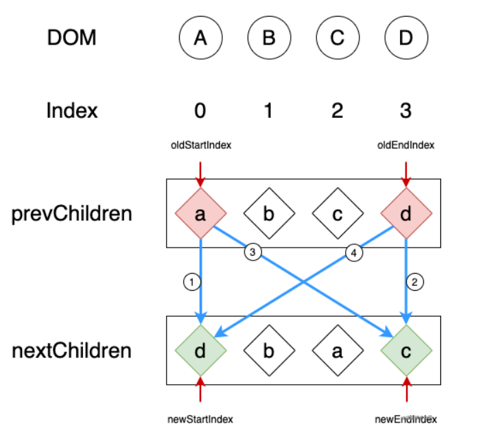
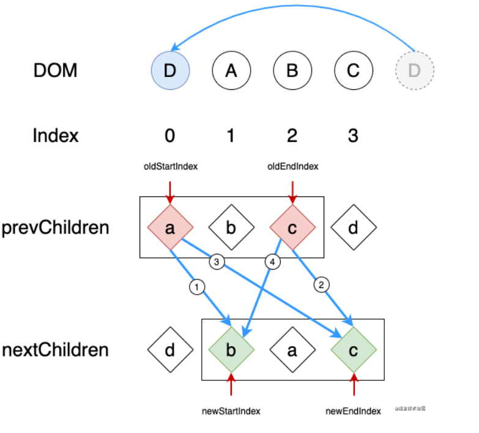
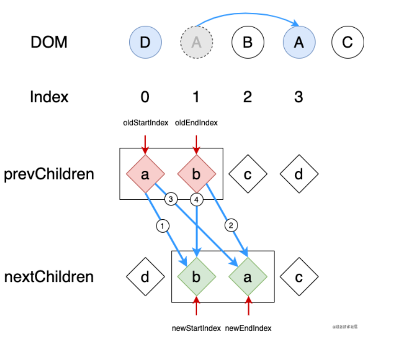
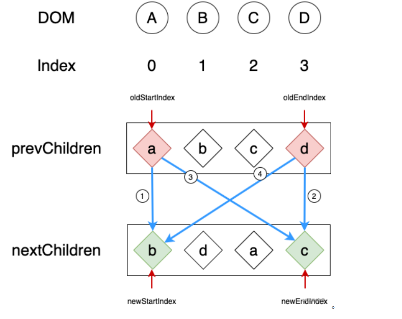

<wx/>

# 组件更新
上一章我们将组件初始化全过程讲解完, 本节将结合数据响应触发组件更新去剖析组件更新原理

### Diff算法复杂度
正常来说Diff算法会如下去对比
::: tip diff
  1. A元素与B元素对比

  2. A元素与B子元素对比

  3. A子元素与B元素对比
:::
这样算的算法复杂度为 O(n^3), 这样的算法复杂度太高了, 实际上当A元素与B元素不同时, 其子节点就都不需要去对比了, 优化后的算法

::: tip diff
  A元素与B元素对比
:::
算法复杂度为 O(n), 大大的降低了算法复杂性, 从而令性能更上一层

### Diff算法的意义
优先重要结论: <font-bold>任何封装的Dom操作都不如原生Api性能来的好</font-bold>
::: tip 那么Diff算法的意义是什么?
  我们可以先举个例子, 页面上一个div进行内容更改, 我们的操作通常是div.innerHTML = content, 对于结构简单的页面来说原生API是最快的, 但是当div里具有大量的标签元素, 此时使用innerHTML就会把大部分没有发生变化的节点也重新渲染了一次, 这完全是浪费的, 所以我们进行新旧节点对比后, 我们就可以将更改后的节点进行迭代, 其余节点则不动, <font-bold>保留了原有标签的状态, 例如Input的focus状态</font-bold>. 看到这里会觉得Diff算法是个不错的算法, 但是每个事物都是具有两面性的, Diff算法虽然优秀, 但伴随着的就是算法计算从而引发的性能下降。

  但是纵观Vue全局组件更新创建来说, Diff算法的好处是远远高于其带来的性能下降缺点.
:::

### patch
```js
  function patch (oldVnode, vnode, hydrating, removeOnly) {
    var insertedVnodeQueue = [];
    if (isUndef(oldVnode)) {
      ...
    } else {
      var isRealElement = isDef(oldVnode.nodeType);
      if (!isRealElement && sameVnode(oldVnode, vnode)) {
        // patch existing root node
        patchVnode(oldVnode, vnode, insertedVnodeQueue, null, null, removeOnly);
      } else {
        if (isRealElement) {
          // mounting to a real element
          // check if this is server-rendered content and if we can perform
          // a successful hydration.
          if (oldVnode.nodeType === 1 && oldVnode.hasAttribute(SSR_ATTR)) {
            oldVnode.removeAttribute(SSR_ATTR);
            hydrating = true;
          }
          if (isTrue(hydrating)) {
            if (hydrate(oldVnode, vnode, insertedVnodeQueue)) {
              invokeInsertHook(vnode, insertedVnodeQueue, true);
              return oldVnode
            } else {
              warn(
                'The client-side rendered virtual DOM tree is not matching ' +
                'server-rendered content. This is likely caused by incorrect ' +
                'HTML markup, for example nesting block-level elements inside ' +
                '<p>, or missing <tbody>. Bailing hydration and performing ' +
                'full client-side render.'
              );
            }
          }
          // either not server-rendered, or hydration failed.
          // create an empty node and replace it
          oldVnode = emptyNodeAt(oldVnode);
        }
        // replacing existing element
        var oldElm = oldVnode.elm;
        var parentElm = nodeOps.parentNode(oldElm);
        // create new node
        createElm(
          vnode,
          insertedVnodeQueue,
          // extremely rare edge case: do not insert if old element is in a
          // leaving transition. Only happens when combining transition +
          // keep-alive + HOCs. (#4590)
          oldElm._leaveCb ? null : parentElm,
          nodeOps.nextSibling(oldElm)
        );
        // update parent placeholder node element, recursively
        if (isDef(vnode.parent)) {
          var ancestor = vnode.parent;
          var patchable = isPatchable(vnode);
          while (ancestor) {
            for (var i = 0; i < cbs.destroy.length; ++i) {
              cbs.destroy[i](ancestor);
            }
            ancestor.elm = vnode.elm;
            if (patchable) {
              for (var i$1 = 0; i$1 < cbs.create.length; ++i$1) {
                cbs.create[i$1](emptyNode, ancestor);
              }
              // #6513
              // invoke insert hooks that may have been merged by create hooks.
              // e.g. for directives that uses the "inserted" hook.
              var insert = ancestor.data.hook.insert;
              if (insert.merged) {
                // start at index 1 to avoid re-invoking component mounted hook
                for (var i$2 = 1; i$2 < insert.fns.length; i$2++) {
                  insert.fns[i$2]();
                }
              }
            } else {
              registerRef(ancestor);
            }
            ancestor = ancestor.parent;
          }
        }
        // destroy old node
        if (isDef(parentElm)) {
          removeVnodes([oldVnode], 0, 0);
        } else if (isDef(oldVnode.tag)) {
          invokeDestroyHook(oldVnode);
        }
      }
    }
    
    invokeInsertHook(vnode, insertedVnodeQueue, isInitialPatch);
    return vnode.elm
  }
```
我们先来看下Vue根节点变更的情况下会怎么处理
1. 若是传入的节点不是一个真正Dom节点(组件传入的是vdom, 而Vue实例传入的是真正Dom), 会先将其变成vdom
2. 调用createElm将新节点重新生成, 并插入到文档里, 具体的可以去深入组件章节里了解
3. 当根节点具有parent则表示该组件是在另外一个组件的直接子级, parent指向了该组件父组件实例


## 深入diff
Vue2.x采用的diff算法，与React不同，React Diff算法有个需要优化的地方
React: 
old: abcd
new: dabc
React的操作是将abc移动到d后面，而不是将d移动到a前面，这里一步能完成的但是分了三步

Vue2.x则是采用双端对比的diff算法，每次循环对比都会分四步走:
1. oldChildren头节点对比newChildren头节点，若是对比上了表示可以复用，那么各自将指针移动到下一步，跳出循环到下一个循环
2. oldChildren尾节点对比newChildren尾节点，若是对比上了表示可以复用，那么各自将指针移动到上一步，跳出循环到下一个循环
3. oldChildren头节点对比newChildren尾节点，若是对比上了表示可以复用，oldChildren往后移一步，newChildren往前移一步，此时将oldChildren里的头节点移动到oldChildren尾节点的后面，跳出循环到下一个循环
4. oldChildren尾节点对比newChildren头节点，若是对比上了表示可以复用，oldChildren往前移一步，newChildren往后移一步，此时将oldChildren里的尾节点移动到oldChildren头节点的前面，跳出循环到下一个循环





还有一种情况就是双端检测都对比不上，如下图，那么Vue就会对newChildren头部节点进行key对比去找出oldchildren里的对应的key，也有两种情况
1. oldChildren里存在对应的key， 将找到的节点移动到oldStartIndex前面，并将oldStartIndex往后移
2. 不存在对应的key，直接创建一个新节点放在头部



